<h1 align="center">World Reward</h1>

<p align="center">
  
</p>

<h3 align="center">Experimentation towards scalable evaluation environments for 3D World Models with verifiable rewards.</h3>

---

**World Reward generates physics test scenarios, renders them as video, and automatically verifies whether the output respects known physical laws — producing a ternary reward signal with no human in the loop.**

> Think of it as **unit tests for reality** — the same way Prime Intellect uses verifiable rewards to improve LLM reasoning, World Reward uses the laws of physics as verifiable rewards to evaluate and improve world models.

**Current stage:** We use **Veo 3.1** (text-to-video) as a proxy world model to prove the concept end-to-end. The architecture is designed to evolve toward **Genie 3** and native 3D world models once API access becomes available — switching from video analysis to direct 3D environment interaction.

**Next frontier:** As browser-use agents continue to improve in performance and reliability, they will unlock a powerful verification path — autonomously navigating 3D environments generated by world models, inspecting physical outcomes from multiple viewpoints, and scaling the reward signal far beyond what passive video analysis can achieve.

## Built with

- **Gemini 3 Pro** (Google DeepMind) — Scenario generation + video verification
- **Veo 3.1** — Video rendering (text-to-video, proxy for world models)
- **Python** — Clean OOP, type hints, dataclasses
- **prompt_toolkit** — Interactive REPL with wizards

## Quick Start

```bash
# 1. Create and activate virtual environment
python3 -m venv .venv
source .venv/bin/activate

# 2. Install dependencies
pip install -r requirements.txt

# 3. Set up your API key
cp .env.example .env
# Edit .env and add your GEMINI_API_KEY

# 4. Launch interactive mode
PYTHONPATH=src python3 main.py
```

## Usage Modes

### Interactive REPL (recommended)

Launch with no arguments to enter the interactive REPL with step-by-step wizards:

```bash
PYTHONPATH=src python3 main.py
```

The REPL provides:
- **`/generate`** — Guided wizard: select domain → count → model
- **`/videos`** — Pick a dataset from the list, videos are generated in parallel
- **`/verify`** — Pick a dataset with videos, verification runs automatically
- **`/domains`** — List available domain configurations
- **`/help`** — Show all commands

Features:
- Animated spinner during API calls (Gemini generation, video upload, VLM analysis)
- Bottom toolbar with pipeline reminder
- Command history (↑/↓ arrows)

### Direct CLI

For scripting or CI, use subcommands directly:

```bash
# List available domains
PYTHONPATH=src python3 main.py list-domains

# Step 1: Generate scenario dataset
PYTHONPATH=src python3 main.py generate --domain autonomous_driving --count 5

# Step 2: Render videos from dataset
PYTHONPATH=src python3 main.py videos --dataset output/datasets/autonomous_driving_XXXX.csv

# Step 3: Verify videos against physics ground truth
PYTHONPATH=src python3 main.py verify --dataset output/datasets/autonomous_driving_XXXX.csv

# Override Gemini model for generation
PYTHONPATH=src python3 main.py generate --domain public_safety --count 10 --model gemini-2.5-flash
```

## Pipeline

```mermaid
flowchart TB
    subgraph GENERATE["① GENERATE — Gemini 3 Pro"]
        YAML["YAML Domain Config"]
        PROMPT["Prompt Builder"]
        GEMINI_GEN["Gemini 3 Pro"]
        DATASET["scenarios.csv"]
        YAML --> PROMPT --> GEMINI_GEN --> DATASET
    end

    subgraph RENDER["② RENDER — World Model"]
        VEO["Veo 3.1 (parallel generation)"]
        VIDEOS["videos/{scenario_id}.mp4"]
        DATASET --> VEO --> VIDEOS
    end

    subgraph VERIFY["③ VERIFY — Gemini 3 Pro (VLM Judge)"]
        UPLOAD["Upload video"]
        VLM["Gemini 3 Pro watches video"]
        COMPARE["Compare VLM answer vs ground truth"]
        VIDEOS --> UPLOAD --> VLM --> COMPARE
    end

    subgraph SCORE["④ SCORE — Reward Signal"]
        REWARD["+1 correct | 0 undetermined | -1 incorrect"]
        REPORT["Per-category accuracy + reward report"]
        COMPARE --> REWARD --> REPORT
    end

    subgraph FUTURE["⑤ FUTURE"]
        direction LR
        GENIE["Genie 3: N 3D environments per prompt"]
        BROWSER["Browser-Use Agent: navigate, inspect, verify"]
        RL["GRPO / RL: train world model with reward signal"]
        GENIE --> BROWSER --> RL
    end

    REPORT -.->|"reward signal feeds into"| FUTURE

    style GENERATE fill:#1a73e8,color:#fff
    style RENDER fill:#34a853,color:#fff
    style VERIFY fill:#ea4335,color:#fff
    style SCORE fill:#fbbc04,color:#000
    style FUTURE fill:#9334e6,color:#fff
```



## Output Structure

Each run is linked by a shared run ID (`{domain}_{timestamp}`):

```
output/
├── datasets/   autonomous_driving_20260207_131855.csv
├── videos/     autonomous_driving_20260207_131855/AD-001.mp4, AD-002.mp4, ...
└── results/    results_autonomous_driving_20260207_131855.csv
```

## Dataset Format

Generated CSV datasets contain:

| Column | Description | Example |
|--------|-------------|---------|
| `scenario_id` | Unique ID | `AD-001` |
| `category` | Physics domain | `vehicle_collision` |
| `world_prompt` | Scene description | Realistic highway, clear weather, daytime |
| `action` | Event that triggers the test | Car hits metal guardrail at 300 km/h |
| `video_prompt` | Cinematic prompt for Veo 3.1 | Wide shot of silver supercar racing... slow motion impact... |
| `verification_question` | Precise yes/no question | Does the car retain its original undamaged shape? |
| `expected_answer` | Ground truth | `no` |
| `confidence` | How unambiguous | `high` |

## Reward Model

| Score | Meaning |
|-------|---------|
| **+1** | VLM answer matches expected physical outcome |
| **0** | Insufficient visual evidence to determine outcome |
| **-1** | VLM answer contradicts expected physical outcome |

## Adding New Domains

Create a YAML file in `configs/`:

```yaml
domain_id: my_domain
domain_name: My Domain Name
description: What this domain covers
context_prompt: Instructions for Gemini on how to generate scenarios
id_prefix: MD

categories:
  - name: category_name
    description: What this category tests
    example_scenarios:
      - "Example scenario description"
```

Then use `/generate` in the REPL or:
```bash
PYTHONPATH=src python3 main.py generate --domain my_domain --count 10
```

## Architecture

```
├── main.py                     # Thin entrypoint — CLI/REPL dispatch
├── src/worldreward/
│   ├── cli.py              # Shared pipeline commands + argparse
│   ├── repl.py             # Interactive REPL with wizards + bottom toolbar
│   ├── spinner.py          # Animated terminal spinner for API calls
│   ├── models.py           # Scenario, VerificationResult, RewardScore dataclasses
│   ├── config_loader.py    # YAML config loading & validation
│   ├── prompt_builder.py   # Structured prompt construction (dataset + video)
│   ├── gemini_client.py    # Gemini API wrapper
│   ├── generator.py        # Dataset generation orchestrator
│   ├── video_generator.py  # Veo 3.1 parallel video rendering
│   ├── verifier.py         # Gemini 3 Pro video analysis + physics verification
│   ├── scorer.py           # Reward aggregation + terminal reporting
│   ├── dataset_writer.py   # CSV read/write (shared loader)
│   └── exceptions.py       # Custom domain errors
├── configs/
│   ├── autonomous_driving.yaml
│   └── public_safety.yaml
├── output/
│   ├── datasets/           # Generated scenario CSV files
│   ├── videos/             # Rendered videos grouped by run ID
│   └── results/            # Verification results CSV files
└── requirements.txt        # google-genai, pyyaml, python-dotenv, prompt_toolkit
```

## The Vision

World Reward is the evaluation and reward layer for 3D world models:

1. **Generate** scenarios with physically predictable outcomes ← `/generate`
2. **Render** through a video/world model (Veo 3.1 now, Genie 3 next) ← `/videos`
3. **Verify** whether the output respects known physical laws ← `/verify`
4. **Score** with ternary verifiable rewards (+1 / 0 / -1)
5. **Optimize** the world model via RL (GRPO, PPO, etc.) using the accumulated reward signal ← *next step*

### Scaling path

The real power unlocks when combining **Genie 3** + **browser-use agents**:

- **Genie 3** generates N interactive 3D environments for the same prompt (e.g., 4 variants of "car hits guardrail at 300 km/h")
- **Browser-use agents** autonomously navigate each environment, perform the action, observe the outcome from multiple viewpoints
- **World Reward** scores each environment with verified physics rewards
- The reward signal feeds directly into **GRPO** or other RL methods to train the world model — closing the loop

This is the same paradigm as verifiable rewards for LLM reasoning (math, code), applied to **physical reasoning in 3D world models**.

### Roadmap

| Phase | Status | Description |
|-------|--------|-------------|
| **Video-based POC** | ✅ Done | Veo 3.1 as proxy world model, Gemini 3 Pro as VLM verifier |
| **Interactive REPL** | ✅ Done | Step-by-step wizards, animated spinners, command history |
| **Genie 3 integration** | 🔜 Next | Generate N 3D environments per prompt, evaluate each independently |
| **Browser-use verification** | 🔮 Future | Agentic browser-use to navigate 3D environments and verify physics from multiple viewpoints |
| **RL training loop** | 🔮 Future | Feed accumulated rewards into GRPO/PPO to improve the world model's physical reasoning |

---

*Built at the Granola x DeepMind Hackathon, London — February 2026*
